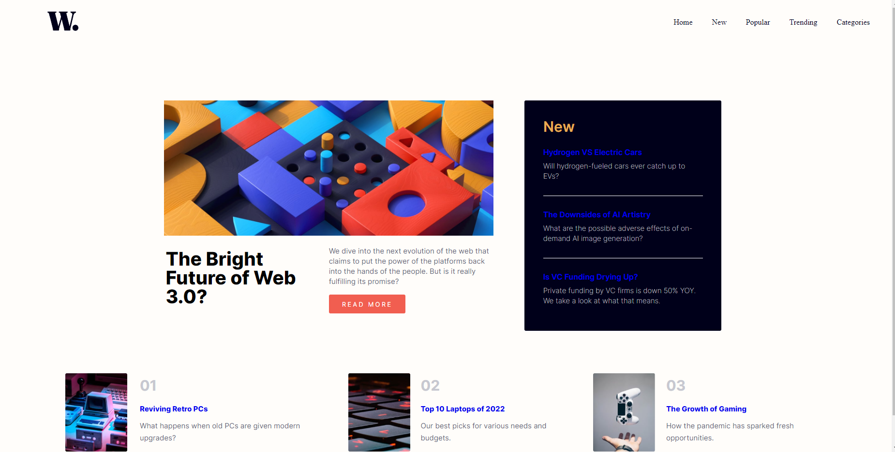
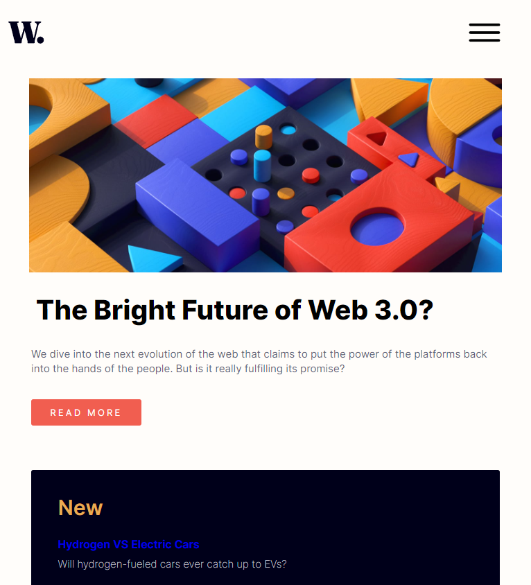
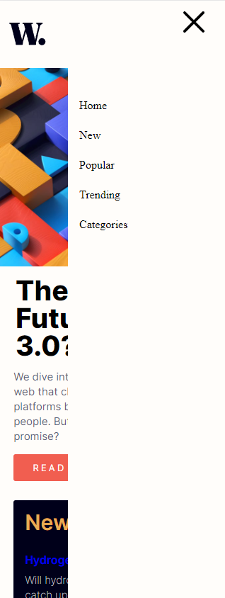

# Frontend Mentor - News homepage solution

This is a solution to the [News homepage challenge on Frontend Mentor](https://www.frontendmentor.io/challenges/news-homepage-H6SWTa1MFl). Frontend Mentor challenges help you improve your coding skills by building realistic projects. 

## Table of contents

- [Overview](#overview)
  - [The challenge](#the-challenge)
  - [Screenshot](#screenshot)
  - [Links](#links)
- [My process](#my-process)
  - [Built with](#built-with)
  - [What I learned](#what-i-learned)
  - [Continued development](#continued-development)
  - [Useful resources](#useful-resources)
- [Author](#author)

## Overview

### The challenge

Users should be able to:

- View the optimal layout for the interface depending on their device's screen size
- See hover and focus states for all interactive elements on the page
- Toggle the mobile menu (requires some JavaScript)

### Screenshot

Below are screenshots of the homepage in different view ports with the offcanvas menu being showed. 


Tablet view port.


Mobile viewport and off canvas menu activated.



### Links

- Solution URL: [Github Repo](https://github.com/J-Wil21/news-homepage)
- Live Site URL: [](https://j-wil21.github.io/news-homepage/)

## My process

### Built with

- Semantic HTML5 markup
- CSS custom properties
- Flexbox
- Javascript
- Mobile-first workflow

### What I learned

I learnt how to create a Off canvas menu and linking to my HTML file.

At the bottom of the HTML file I added a Script tag``` <script>``` in order for the HTML file and the Javascript file to link.

When creating the Offset menu I had to make a funcation which would add a class and also remove it. that class would be ```.active``` and that would allow the offcanvas menu to be able to appear and disappear. 

### Continued development

I would like to work with Javascript more and incorporate it within my projects.

### Useful resources

- [Mdn Doc](https://developer.mozilla.org/en-US/) - This helped me refresh my mind for different classes. I appricate how easy the website is to use when looking for information.

## Author

- Website - [Joshua](https://j-wil21.github.io/news-homepage/)
- Frontend Mentor - [@JWil21](https://www.frontendmentor.io/profile/J-Wil21)

